# Flow của Business Store

Bản đồ luồng chạy thật của code, vẽ theo những gì đang có trong `src/` và `frontend/src/`
(không phải theo dự định). Bổ sung cho [`architecture.md`](architecture.md) — bên đó nói *code
nằm ở đâu*, bên này nói *dữ liệu đi qua đâu*.

Mermaid render sẵn trên GitHub. Mục [Bẫy dễ đọc nhầm](#bẫy-dễ-đọc-nhầm) ở cuối ghi những chỗ
sơ đồ trông có vẻ khác thực tế.

---

## 1. Bản đồ tổng thể

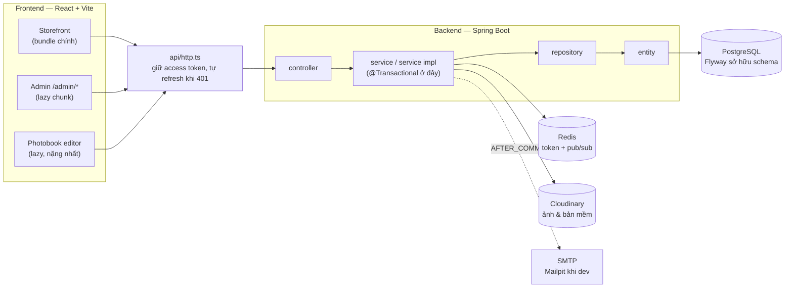

Quy tắc phân lớp: controller chỉ bind DTO và gọi **một** service; ranh giới `@Transactional`
nằm ở service; repository dùng derived query có kèm ownership (`findByIdAndUserId`) thay vì
`findById` rồi tự kiểm sau.

---

## 2. Vòng đời một request

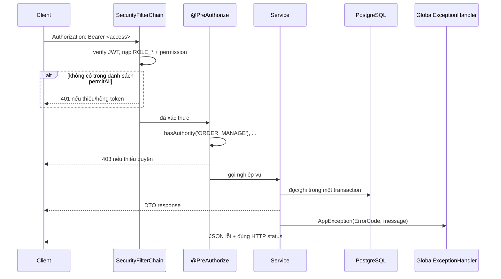

Lỗi luôn đi qua `AppException(ErrorCode, message)` → handler tập trung dịch ra status. Thêm
tình huống lỗi mới nghĩa là thêm hằng số vào `ErrorCode`, không ném exception trần.

---

## 3. Mua hàng: giỏ → thanh toán → đơn

Đây là luồng nhiều bất biến nhất. **Backend tính lại toàn bộ**, không tin số từ giỏ.

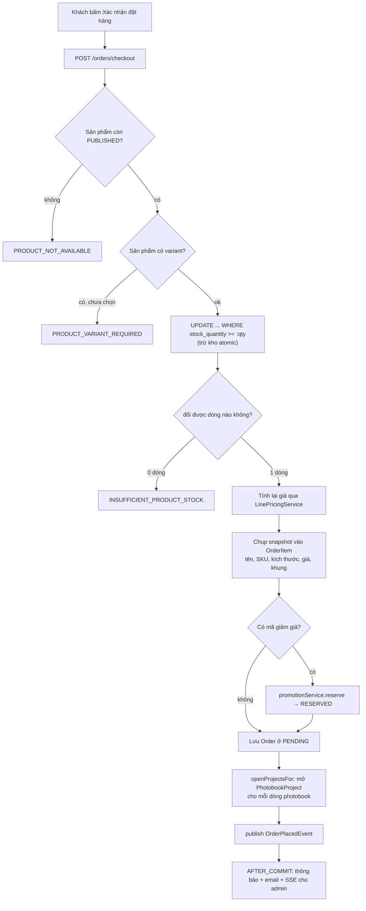

Ba điểm dễ làm hỏng nếu sửa ẩu:

- **Giá tính lại từ `LinePricingService`**, dùng chung với giỏ hàng và cả preview khuyến mãi —
  lệch một nơi là khách trả sai tiền.
- **`OrderItem` là bản chụp bất biến**: sửa danh mục sau này không được đổi đơn cũ.
- **Trừ kho phải nằm trong chính câu `UPDATE` có điều kiện.** Đọc ra rồi mới trừ *không* an
  toàn kể cả khi đã `SELECT ... FOR UPDATE`, vì entity thường đã nằm trong persistence context
  nên Hibernate trả lại số cũ trong bộ nhớ.

---

## 4. Máy trạng thái đơn hàng

Điều dễ hiểu nhầm nhất: **mỗi mũi tên do một endpoint khác nhau bắn**, không phải một API
"đổi trạng thái" chung.

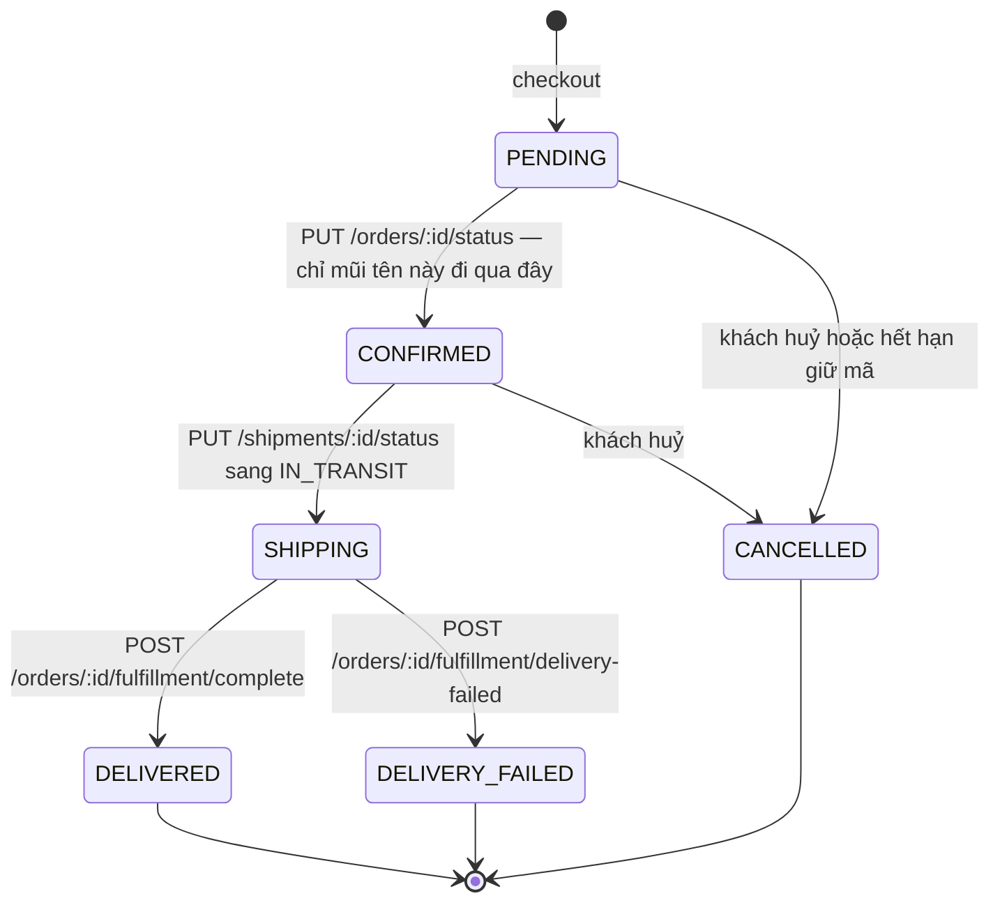

`DELIVERED` và `DELIVERY_FAILED` **không** đi qua `PUT /shipments/{id}/status` được, vì hai
bước đó còn đụng cả Payment lẫn Order nên phải là endpoint nguyên tử riêng.

Khi huỷ hoặc giao thất bại: hoàn kho (UPDATE atomic), huỷ khoản COD đang chờ, và trả lại mã
giảm giá.

---

## 5. Vận đơn, thanh toán, hoàn tiền

**Vận đơn**

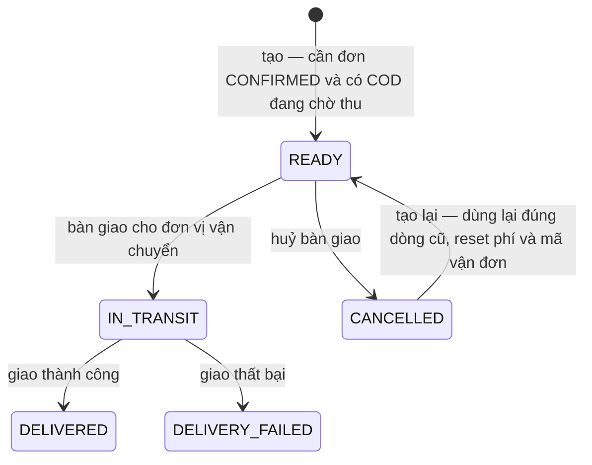

**Thanh toán** (hiện chỉ có COD)

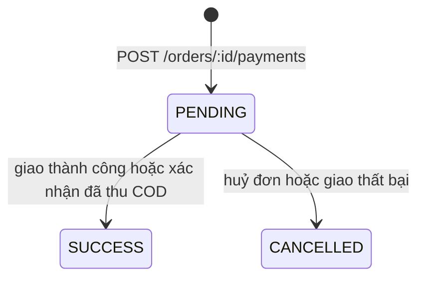

**Hoàn tiền**

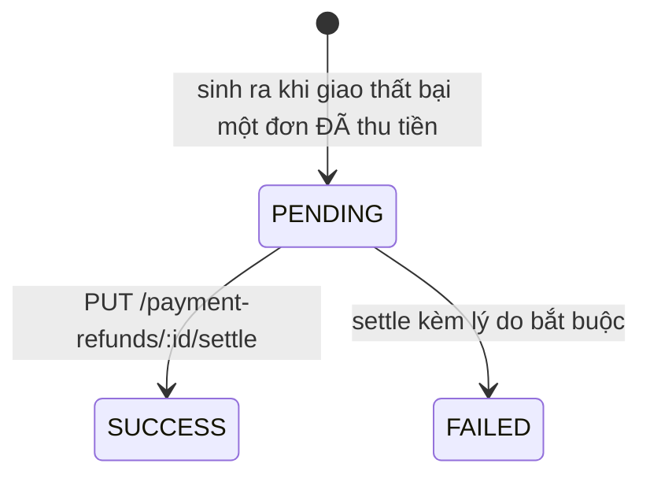

Tiền chuyển thật nằm ngoài hệ thống (chuyển khoản/tiền mặt); `settle` chỉ ghi nhận kết quả,
khoá dòng khi chốt và không cho chốt lại khoản đã chốt.

---

## 6. Khuyến mãi: đặt chỗ ba trạng thái

Quota **không** dựa vào Redis. Đúng/sai do Postgres giữ bằng `UPDATE` có điều kiện.

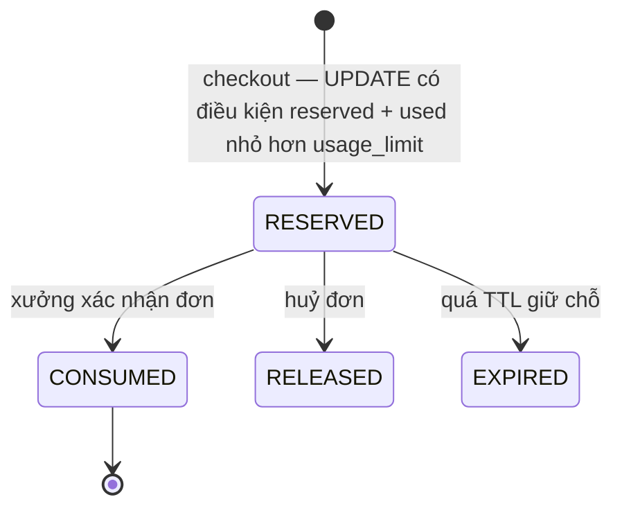

Các chốt chặn khi áp mã: còn hiệu lực theo thời gian và `status = ACTIVE`, đạt
`minOrderAmount`, chưa hết `usageLimit` toàn hệ thống, chưa hết `perUserLimit` của người đó,
và mức giảm bị chặn trên bởi `maxDiscountAmount`.

---

## 7. Photobook — bốn khái niệm khác nhau

Đây là phần đồ sộ nhất và rất dễ nhầm lẫn bốn thứ này với nhau.

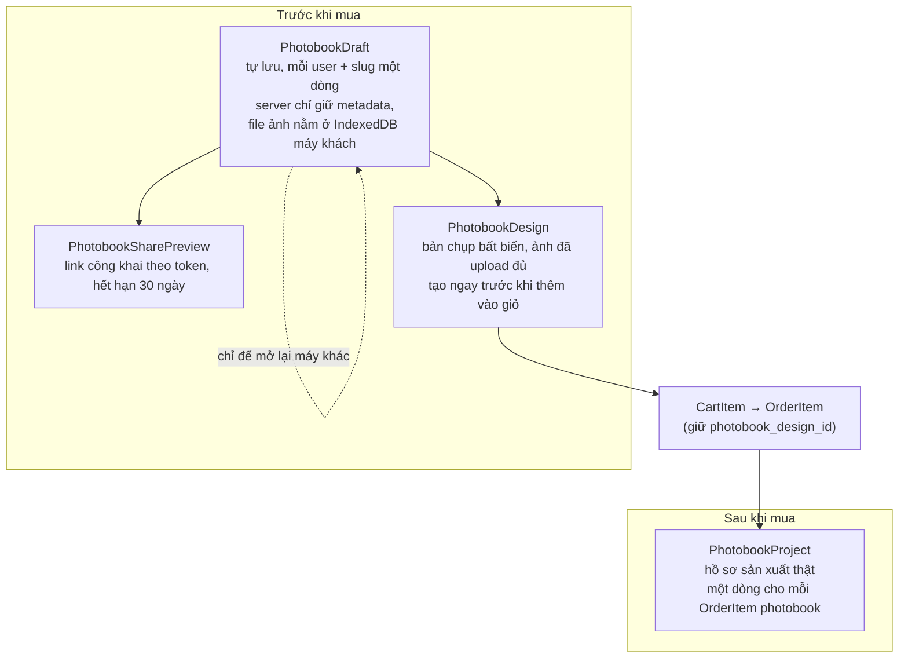

Hai đường vào sản xuất:

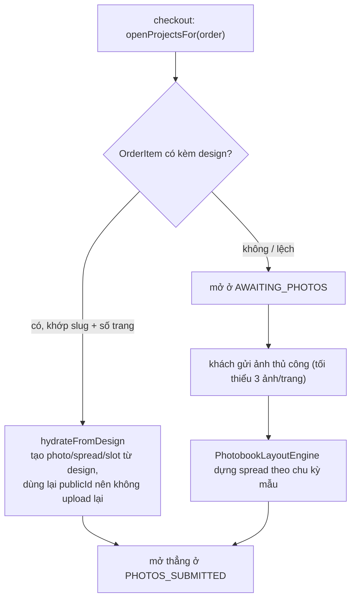

Vòng duyệt bản mềm:

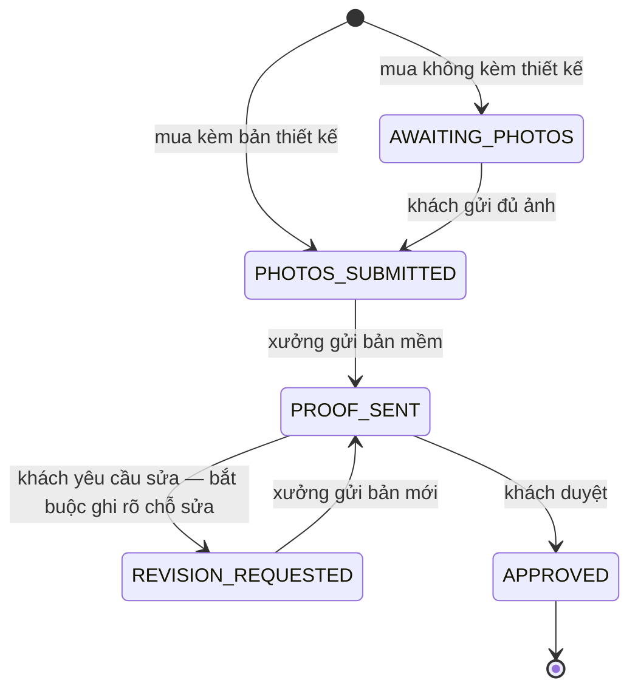

Tối đa **2 lượt sửa miễn phí**; hết lượt thì `PHOTOBOOK_REVISION_LIMIT_REACHED`. Khách còn
đổi được bố cục ở trang *Sắp xếp* khi project đang ở `PHOTOS_SUBMITTED`.

Mã bố cục (`TRAN_DOI`, `DOI_CAN`, `CONTACT_SHEET`, …) phải **giống hệt từng ký tự** giữa
`frontend/src/data/spreadLayouts.ts` và bảng `photobook_layouts`: mã chọn ở client được dùng
thẳng ở server, không có bước dịch.

---

## 8. Đặt in theo yêu cầu

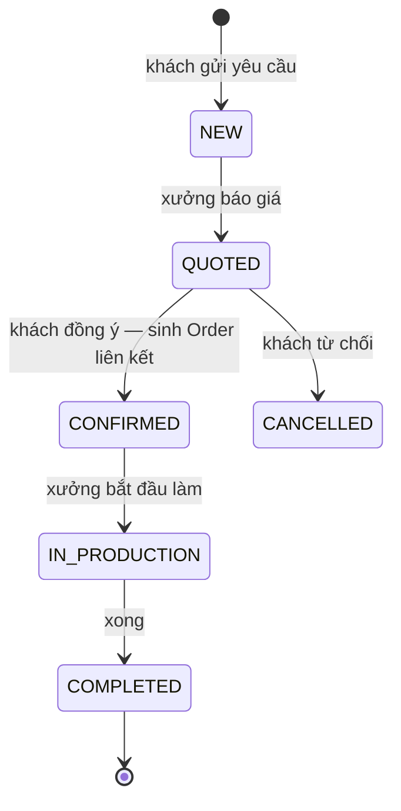

Khách phải chọn địa chỉ giao trước khi đồng ý báo giá; đồng ý hai lần bị chặn.

---

## 9. Thông báo và SSE cho admin

Hai cơ chế tách rời, dễ tưởng là một.

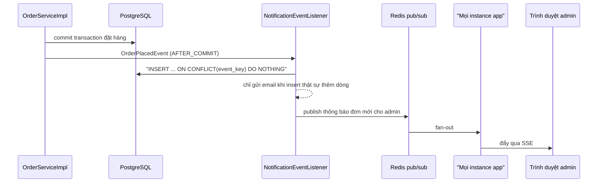

Vì sao phải qua Redis: mỗi instance chỉ giữ SSE client của chính nó, nên thông báo phải phát
tán liên-instance chứ không thể là event trong tiến trình. Email hỏng chỉ được ghi log, **không
bao giờ** làm rollback nghiệp vụ đã commit.

---

## 10. Xác thực và phân quyền

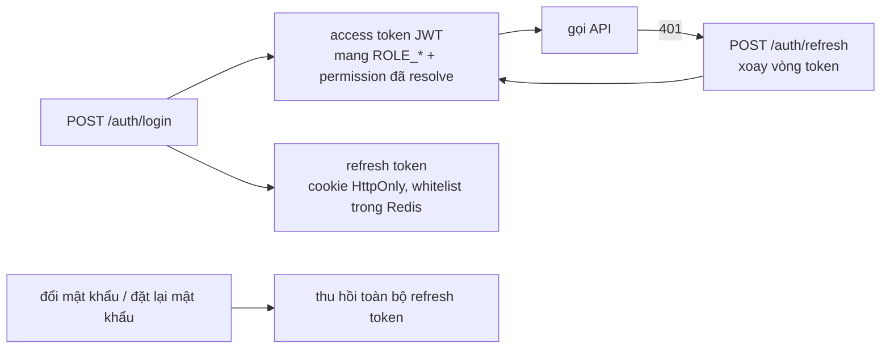

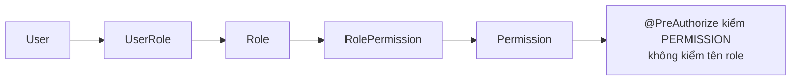

Nhờ vậy admin cấp/gỡ được từng quyền cho `STAFF` mà không phải sửa code. Route guard phía
frontend **chỉ để giao diện gọn**; thẩm quyền thật nằm ở `@PreAuthorize` và các truy vấn theo
chủ sở hữu.

---

## 11. Bản đồ route frontend

| Route | Trang | Ghi chú |
|---|---|---|
| `/` | HomePage | |
| `/danh-muc/:slug`, `/tranh/:slug` | Danh mục, chi tiết tranh | |
| `/tim-kiem`, `/kho-va-gia` | Tìm kiếm, bảng khổ & giá | |
| `/gio-hang` → `/thanh-toan` | Giỏ → thanh toán | giỏ khách vãng lai gộp vào khi đăng nhập |
| `/don-hang-cua-toi/:orderId?` | Đơn của tôi | có dòng thời gian và nút huỷ |
| `/photobook`, `/photobook/:slug` | Danh sách, trình thiết kế | lazy-load |
| `/xem-truoc/:token` | Xem trước công khai | không cần đăng nhập |
| `/photobook-cua-toi/:id`, `/…/sap-xep` | Gửi ảnh, sắp xếp | sau khi mua |
| `/dat-in` | Đặt theo yêu cầu | |
| `/yeu-thich`, `/thong-bao`, `/account` | Yêu thích, thông báo, tài khoản | cần đăng nhập |
| `/admin/*` | Khu quản trị | một lazy chunk, chặn theo permission |
| `/403`, `*` | Không đủ quyền, 404 | |

---

## Bẫy dễ đọc nhầm

| Chỗ | Thực tế |
|---|---|
| `OrderStatus.PROCESSING` | **Không code nào đặt trạng thái này.** Có trong enum, được cộng vào dashboard và hiện trong ô lọc của admin, nhưng lọc luôn ra rỗng. |
| Nhánh sinh hoàn tiền | Chỉ chạy khi giao thất bại một đơn **đã** thu tiền. Với COD hiện tại gần như không với tới được, vì payment chỉ `SUCCESS` khi đơn đã `DELIVERED`, mà `DELIVERED` thì không giao thất bại được nữa. Nó là phần dựng sẵn cho phương thức trả trước. |
| `SELECT ... FOR UPDATE` khi trừ kho | Không đủ an toàn nếu entity đã được nạp trước đó trong cùng transaction. Việc giữ chỗ tồn kho phải nằm trong chính câu `UPDATE` có điều kiện. |
| Hai cờ `editable` của photobook | Ở `PhotobookProject` nghĩa là *còn thêm/xoá ảnh được*; ở arrangement nghĩa là *còn đổi bố cục được* (`PHOTOS_SUBMITTED`). Hai thứ khác nhau. |
| Số ảnh của photobook | "60–80 ảnh" là lượng gửi cho **xưởng tự bố cục** (gửi dư để xưởng chọn). Khi khách **tự thiết kế** thì chỉ cần đúng số ô của chủ đề, ít hơn nhiều. |
| `photobook_drafts` | Không đơn hàng nào tham chiếu tới nó. Đơn hàng gắn với `PhotobookDesign`. |
| Cột JSON thô | `photobook_layouts.slots`, `photobook_designs.spreads_json`, … cố ý không chuẩn hoá vì không có nhu cầu truy vấn vào bên trong. |
| Migration Flyway | Không bao giờ sửa file migration đã chạy; luôn thêm `V<n+1>__*.sql` mới. |
