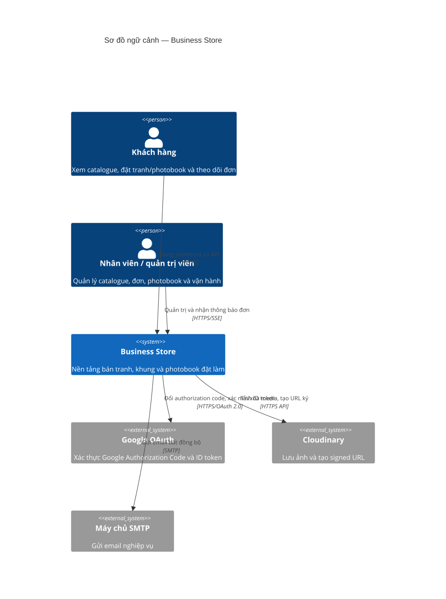

# Kiến trúc Business Store

Tài liệu này chỉ mô tả những gì tìm thấy trong repository `demo/` tại thời điểm rà soát. Đây là một **modular monolith**: backend Maven/Spring Boot duy nhất và frontend React/Vite là package Node.js riêng. Không có bằng chứng về Maven multi-module, microservice, API gateway độc lập, Kafka/RabbitMQ hay Kubernetes.

## Tổng quan

Business Store bán tranh, khung, sản phẩm photobook và đơn đặt riêng. Backend cung cấp REST API `/api/v1`, JWT/RBAC, SSE cho thông báo đơn mới của admin, xử lý checkout/đơn hàng/khuyến mãi, và lưu media qua Cloudinary. Frontend có storefront và khu vực quản trị, gọi API trực tiếp khi phát triển hoặc qua Nginx reverse proxy khi đặt `API_UPSTREAM`.



Nguồn Mermaid: [diagrams/c4-context.mmd](diagrams/c4-context.mmd).

## Tech stack

| Phần | Công nghệ đã xác minh |
|---|---|
| Backend | Java 21, Spring Boot 4.1.0, Spring MVC, Spring Security, Spring Data JPA/Redis, Flyway, MapStruct, Lombok |
| Frontend | React 19, TypeScript, React Router 7, Vite 5, Vitest |
| Dữ liệu | PostgreSQL 17, schema migration Flyway; Redis 7.4 cho token/rate-limit/pub-sub |
| Media & danh tính | Cloudinary SDK; Google OAuth Authorization Code/ID token |
| Email | Spring Mail qua SMTP; Mailpit trong local Compose |
| Đóng gói | Dockerfile backend (Maven → JRE 21); Dockerfile frontend (Node 22 → Nginx 1.27) |

## Module và trách nhiệm

| Module/package | Trách nhiệm |
|---|---|
| `frontend/` | SPA storefront, cart, checkout, account, admin và trải nghiệm photobook |
| `controller/` | REST/SSE controller dưới `/api/v1`; chỉ nhận DTO và gọi service |
| `service/impl/` | Nghiệp vụ catalogue, cart, order, payment, promotion, photobook, thông báo và IAM |
| `repository/`, `entity/`, `db/migration/` | Persistence JPA và schema PostgreSQL do Flyway quản lý |
| `security/` | JWT access/refresh, RBAC, CORS, rate limiting bằng Redis |
| `configuration/` | Cấu hình Cloudinary, Redis pub/sub, async mail, seed/bootstrap và MVC |

## API inventory rút gọn

| Nhóm | Endpoint chính (tên thật) |
|---|---|
| Xác thực & tài khoản | `POST /api/v1/auth/register`, `/login`, `/google`, `/refresh`, `/logout`, `/password/*`; `GET/PUT /api/v1/users/me` |
| Catalogue | `GET /api/v1/products`, `/products/slug/{slug}`, `/categories`, `/frames`, `/materials`, `/art-sizes`; các endpoint management yêu cầu quyền |
| Cart và yêu thích | `GET /api/v1/cart`, `POST /api/v1/cart/items`, `PUT/DELETE /api/v1/cart/items/{itemId}`; `/api/v1/wishlist/*` |
| Đơn và thanh toán | `POST /api/v1/orders/checkout`, `GET /api/v1/orders/my-orders`; `POST /api/v1/orders/{orderId}/payments`; các quản trị endpoint `/orders`, `/payments`, `/shipments` |
| Photobook | `/api/v1/photobook-projects/*`, `/photobook-designs`, `/photobook-drafts`, `/photobook-templates`, `/photobook-share-previews` |
| Notification | `GET/PATCH /api/v1/notifications/*`; `GET /api/v1/admin/order-notifications/stream` là SSE |

Danh mục trên là điểm vào kiến trúc chính, không phải OpenAPI đầy đủ. Cần kiểm tra các lớp trong `src/main/java/com/example/businessstore/controller/` để có toàn bộ tham số, authorization và response contract.

## Sơ đồ luồng nghiệp vụ

- [Đăng nhập](flows/authentication-login.md)
- [Checkout đơn hàng](flows/checkout-order.md)
- [Ảnh và duyệt proof photobook](flows/photobook-proof-review.md)
- [Báo giá đơn đặt riêng](flows/custom-order-quote.md)
- [Vận chuyển và thu COD](flows/cod-fulfillment.md)
- [Thông báo đơn mới cho admin qua SSE](flows/admin-order-sse.md)

## Giao tiếp và persistence

- `business-store-frontend` → `business-store`: JSON/HTTPS qua `VITE_API_BASE`; Nginx chỉ proxy `/api/` khi có `API_UPSTREAM`.
- `business-store` → PostgreSQL: JPA/JDBC; Flyway chạy migration và Hibernate ở chế độ `validate`.
- `business-store` → Redis: refresh-token whitelist, access-token blacklist, password-reset token, counter rate-limit; Redis pub/sub đẩy thông báo order mới đến SSE stream.
- `business-store` → Cloudinary: upload/destroy media và signed URL private. Tên biến cấu hình: `CLOUDINARY_CLOUD_NAME`, `CLOUDINARY_API_KEY`, `CLOUDINARY_API_SECRET`.
- `business-store` → Google: OAuth 2.0 code exchange và ID token verification. Tên biến: `GOOGLE_OAUTH_CLIENT_ID`, `GOOGLE_OAUTH_CLIENT_SECRET`.
- `business-store` → SMTP: email bất đồng bộ sau Spring transaction commit. Tên biến: `MAIL_HOST`, `MAIL_PORT`, `MAIL_USERNAME`, `MAIL_PASSWORD`, `MAIL_FROM`.

## Chạy local

Từ `demo/`:

```powershell
Copy-Item .env.example .env
docker compose up -d postgres redis mailpit
.\mvnw.cmd spring-boot:run
```

Mở một terminal khác:

```powershell
Set-Location frontend
Copy-Item .env.example .env
npm ci
npm run dev
```

Backend mặc định nghe `SERVER_PORT` (8080); frontend Vite mặc định phát triển ở cổng do Vite chọn (README dự án ghi 5173). Không sao chép giá trị secret vào tài liệu: hãy cấp các biến như `DB_PASSWORD`, `JWT_SECRET`, `REDIS_PASSWORD`, các biến Cloudinary/Google/SMTP trong `.env` riêng.

Lưu ý: `docker-compose.yml` chỉ khai báo PostgreSQL, Redis và Mailpit, **không** khai báo service backend/frontend. Dockerfile cho cả hai có tồn tại; muốn chạy toàn bộ bằng Compose cần một compose bổ sung — **Chưa xác minh** vì file đó không có trong repository.

## Evidence

| Nhận định | Bằng chứng trong code/config |
|---|---|
| Một backend Spring Boot, không phải Maven multi-module | `pom.xml` có một artifact `business-store` và không có `<modules>`; `BusinessStoreApplication.java` |
| Frontend React/Vite là package riêng | `frontend/package.json`, `frontend/src/main.tsx`, `frontend/vite.config.ts` |
| REST API và SSE | `controller/*Controller.java`; `AdminOrderNotificationController.java` có `/api/v1/admin/order-notifications/stream` và `TEXT_EVENT_STREAM_VALUE` |
| PostgreSQL + Flyway | `src/main/resources/application-dev.yaml`; `src/main/resources/db/migration/`; `pom.xml` |
| Redis token/rate-limit/pub-sub | `service/impl/RedisTokenStore.java`, `security/AuthRateLimitInterceptor.java`, `configuration/RedisPubSubConfiguration.java`, `service/impl/AdminOrderNotificationPublisher.java` |
| Checkout mở project photobook và phát event | `service/impl/OrderServiceImpl.java`, `service/impl/PhotobookProjectServiceImpl.java`, `service/impl/NotificationEventListener.java` |
| Google OAuth và Cloudinary | `service/impl/GoogleOAuthServiceImpl.java`, `service/impl/CloudinaryMediaStorageService.java`, `configuration/CloudinaryConfiguration.java` |
| Local infrastructure | `docker-compose.yml`, `Dockerfile`, `frontend/Dockerfile`, `frontend/nginx/api-proxy.conf` |

## Chưa xác minh

- Không có manifest Kubernetes, Terraform, Jenkinsfile, GitHub Actions hay cấu hình CI/CD trong tree đã rà soát. Cần kiểm tra repository/hệ thống triển khai bên ngoài nếu chúng tồn tại ở nơi khác.
- Không có payment gateway HTTP/webhook trong `PaymentServiceImpl`; payment hiện thể hiện luồng COD/manual. Cần kiểm tra integration ở hệ thống ngoài nếu có.
- Không có dịch vụ vận chuyển bên ngoài hay API carrier trong source/config. `ShipmentServiceImpl` là persistence/nghiệp vụ nội bộ.
