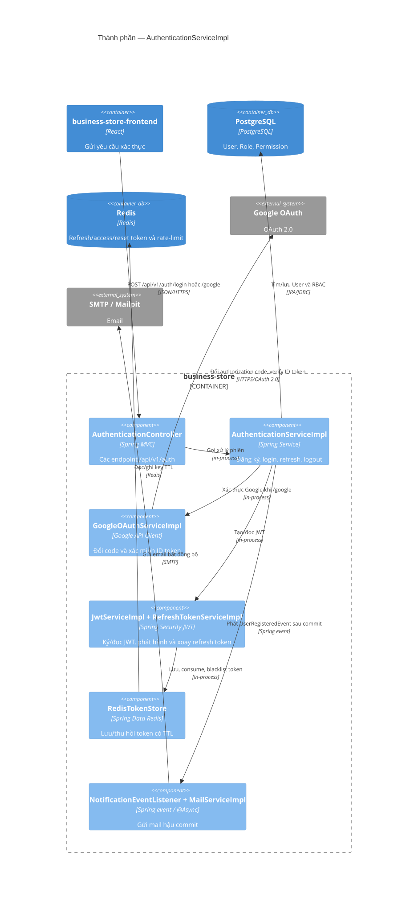

# C4 Component — AuthenticationServiceImpl

Nguồn Mermaid: [diagrams/c4-components-authentication.mmd](diagrams/c4-components-authentication.mmd).

`AuthenticationController` đặt refresh token trong cookie `HttpOnly`, còn `AuthResponse` chứa access token. `RefreshTokenServiceImpl` dùng `RedisTokenStore` để refresh-token rotation; logout blacklist access token khi nó còn decode được. `UserRegisteredEvent` được `NotificationEventListener` tiêu thụ sau commit để gửi welcome email bất đồng bộ.

Evidence: `AuthenticationController.java`; `AuthenticationServiceImpl.java`; `RefreshTokenServiceImpl.java`; `RedisTokenStore.java`; `NotificationEventListener.java`; `MailServiceImpl.java`.
