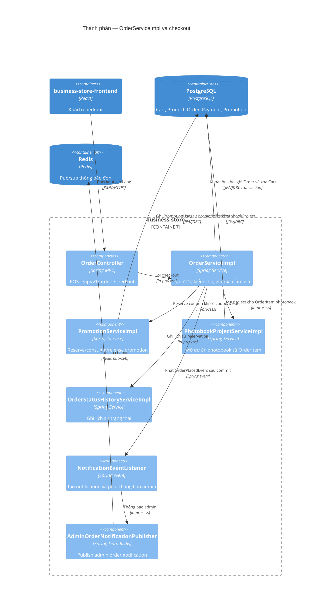

# C4 Component — OrderServiceImpl

Nguồn Mermaid: [diagrams/c4-components-order.mmd](diagrams/c4-components-order.mmd).

Checkout chạy trong transaction: đọc giỏ/địa chỉ, khóa inventory, ghi snapshot đơn hàng và xóa giỏ. Khi có coupon, `PromotionServiceImpl.reserve` được gọi; khi có item photobook, `PhotobookProjectServiceImpl.openProjectsFor` tạo project. `OrderPlacedEvent` chỉ được xử lý bởi `NotificationEventListener` sau commit và publisher dùng Redis pub/sub.

Evidence: `OrderController.java`; `OrderServiceImpl.java`; `PromotionServiceImpl.java`; `PhotobookProjectServiceImpl.java`; `NotificationEventListener.java`; `AdminOrderNotificationPublisher.java`.
