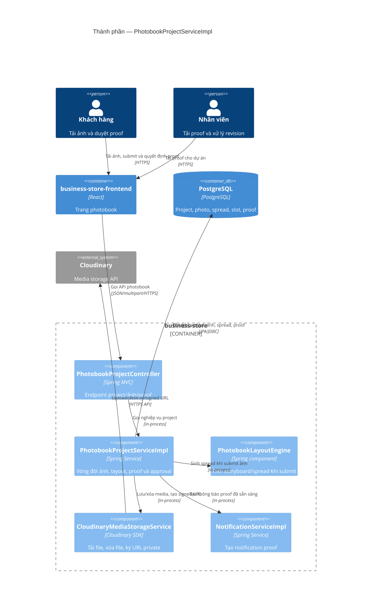

# C4 Component — PhotobookProjectServiceImpl

Nguồn Mermaid: [diagrams/c4-components-photobook.mmd](diagrams/c4-components-photobook.mmd).

Service này quản lý vòng đời project từ ảnh khách hàng đến proof. Ảnh/proof được upload vào Cloudinary trước rồi bản ghi PostgreSQL được tạo trong transaction; các callback đồng bộ media sau commit/rollback được dùng để giảm orphan media. Khi khách gửi ảnh, `PhotobookLayoutEngine` sinh spreads; khi nhân viên upload proof, service tạo notification cho khách.

Evidence: `PhotobookProjectController.java`; `PhotobookProjectServiceImpl.java`; `CloudinaryMediaStorageService.java`; `MediaTransactionSynchronizer.java`; `NotificationServiceImpl.java`.
