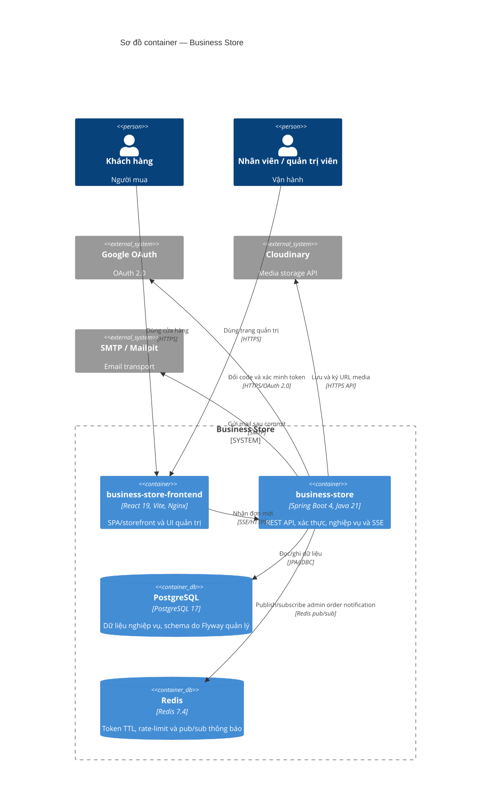

# C4 Container — Business Store

Nguồn Mermaid: [diagrams/c4-containers.mmd](diagrams/c4-containers.mmd).

`business-store-frontend` là UI React/Vite; `business-store` là một deployable Spring Boot monolith. Nginx thuộc image frontend và là reverse proxy tùy chọn, không phải gateway độc lập. Redis không phải message broker Kafka/RabbitMQ: pub/sub của Redis chỉ được dùng cho thông báo admin giữa các instance/stream service.

Evidence: `frontend/package.json`; `frontend/nginx/30-api-proxy.sh`; `pom.xml`; `application-dev.yaml`; `docker-compose.yml`; `RedisPubSubConfiguration.java`; `AdminOrderNotificationPublisher.java`.

Chưa xác minh: topology production (số instance, reverse proxy/ingress, managed database) không có trong repository.
