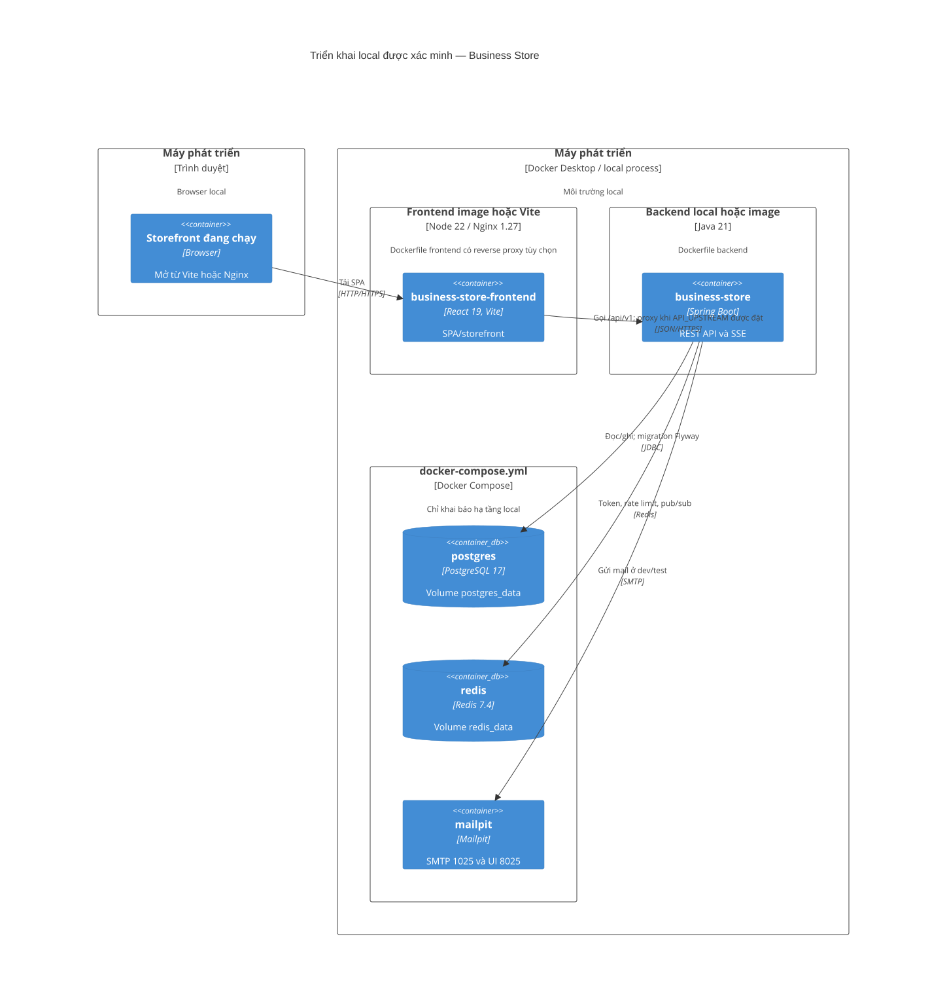

# C4 Deployment — local infrastructure

Nguồn Mermaid: [diagrams/c4-deployment.mmd](diagrams/c4-deployment.mmd).

Sơ đồ chỉ biểu diễn deployment/local infrastructure có bằng chứng. `docker-compose.yml` chạy PostgreSQL, Redis và Mailpit. Backend và frontend có Dockerfile riêng, nhưng không được thêm vào compose hiện tại; chúng cũng có thể chạy như process local qua Maven Wrapper/Vite. Frontend Nginx chỉ proxy `/api/` nếu runtime env `API_UPSTREAM` có giá trị.

Evidence: `docker-compose.yml`; `Dockerfile`; `frontend/Dockerfile`; `frontend/nginx/default.conf.template`; `frontend/nginx/api-proxy.conf`; `application-dev.yaml`.

Chưa xác minh: production deployment, Kubernetes, reverse proxy public, CDN, CI/CD và secret manager — không tìm thấy manifest/config tương ứng trong repository.
