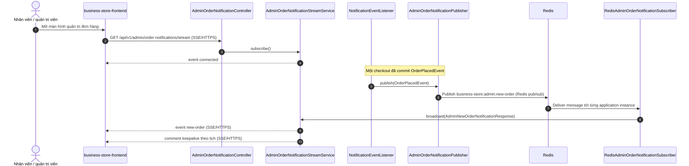

# Luồng thông báo đơn mới cho admin

Endpoint chính: `GET /api/v1/admin/order-notifications/stream`.

Nguồn Mermaid: [sequence](../diagrams/flow-admin-order-sse-sequence.mmd) · [activity](../diagrams/flow-admin-order-sse-activity.mmd).

Admin cần quyền `CAN_MANAGE_ORDERS` để subscribe SSE. `SseEmitter` là local theo application instance; Redis pub/sub cấp cùng message cho subscriber trên từng instance và subscriber broadcast tới emitter local. Publisher bắt lỗi Redis và chỉ log warning, vì checkout đã commit không được thất bại do live alert unavailable. Keepalive mặc định chạy theo scheduler; giá trị interval cấu hình chưa được đưa vào tài liệu vì dùng cấu hình runtime.

Evidence: `AdminOrderNotificationController.java`; `AdminOrderNotificationStreamService.java`; `AdminOrderNotificationPublisher.java`; `RedisAdminOrderNotificationSubscriber.java`; `RedisPubSubConfiguration.java`; `NotificationEventListener.java`.
