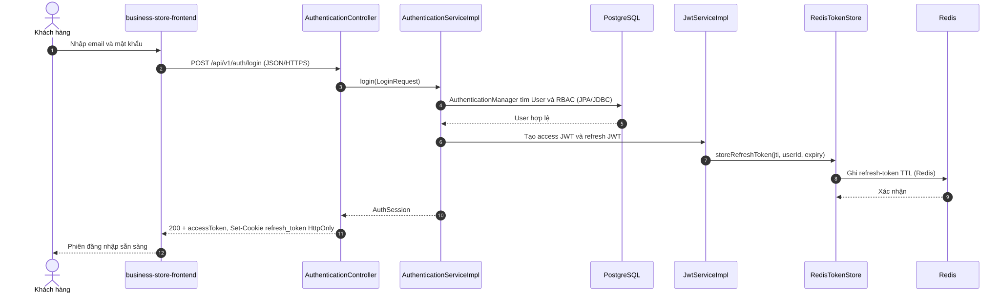

# Luồng đăng nhập local

Endpoint chính: `POST /api/v1/auth/login`.

Nguồn Mermaid: [sequence](../diagrams/flow-authentication-login-sequence.mmd) · [activity](../diagrams/flow-authentication-login-activity.mmd).

`AuthRateLimitInterceptor` thực thi counter theo IP trên Redis trước controller. `AuthenticationServiceImpl` sử dụng `AuthenticationManager`, tạo access JWT và refresh JWT; refresh JTI được lưu TTL trong Redis. Controller trả access token trong response và ghi refresh token vào cookie `HttpOnly`/`SameSite=Strict`.

Evidence: `AuthenticationController.java`; `AuthenticationServiceImpl.java`; `AuthRateLimitInterceptor.java`; `RefreshTokenServiceImpl.java`; `RedisTokenStore.java`.
