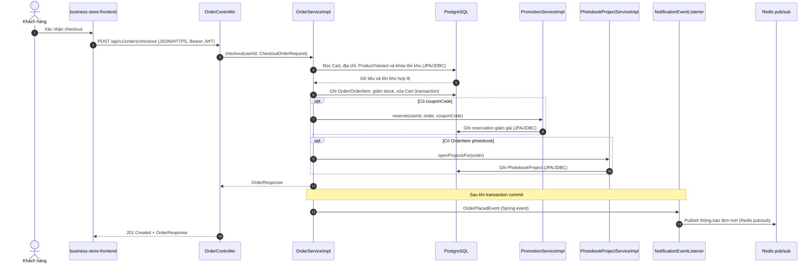

# Luồng checkout đơn hàng

Endpoint chính: `POST /api/v1/orders/checkout`.

Nguồn Mermaid: [sequence](../diagrams/flow-checkout-order-sequence.mmd) · [activity](../diagrams/flow-checkout-order-activity.mmd).

`OrderServiceImpl.checkout` dùng transaction và repository lock để kiểm tồn kho trước khi giảm stock. Mã giảm giá chỉ được reserve trong checkout khi có `couponCode`; project photobook chỉ được mở với item photobook. Việc thông báo admin bắt đầu sau transaction commit qua Spring event, sau đó Redis pub/sub cấp event cho SSE stream. Không có gọi payment gateway trong flow này; việc tạo/confirm COD nằm ở endpoint payment/fulfillment riêng.

Evidence: `OrderController.java`; `OrderServiceImpl.java`; `PromotionServiceImpl.java`; `PhotobookProjectServiceImpl.java`; `NotificationEventListener.java`; `AdminOrderNotificationPublisher.java`.
