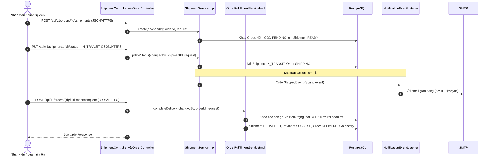

# Luồng vận chuyển và thu COD

Endpoint chính: endpoint tạo/cập nhật shipment trong `ShipmentController`, `POST /api/v1/orders/{id}/fulfillment/complete`, `POST /api/v1/orders/{id}/fulfillment/delivery-failed`.

Nguồn Mermaid: [sequence](../diagrams/flow-cod-fulfillment-sequence.mmd) · [activity](../diagrams/flow-cod-fulfillment-activity.mmd).

Tạo vận đơn chỉ dành cho order `CONFIRMED` có khoản COD `PENDING`. Chuyển vận đơn sang `IN_TRANSIT` chuyển order sang `SHIPPING` và phát `OrderShippedEvent`. Hoàn tất giao chỉ chấp nhận `SHIPPING` + `IN_TRANSIT` + COD `PENDING`, rồi atomically ghi `DELIVERED`/`SUCCESS`. Khi giao thất bại, service hoàn tồn kho, release coupon và xử lý hủy COD hoặc tạo `PaymentRefund PENDING` nếu đã thanh toán thành công.

Evidence: `ShipmentServiceImpl.java`; `OrderFulfillmentServiceImpl.java`; `OrderController.java`; `NotificationEventListener.java`.

Chưa xác minh: `PaymentRefund PENDING` không có code gọi payment-provider hoặc webhook xác nhận hoàn tiền trong repository đã rà soát.
