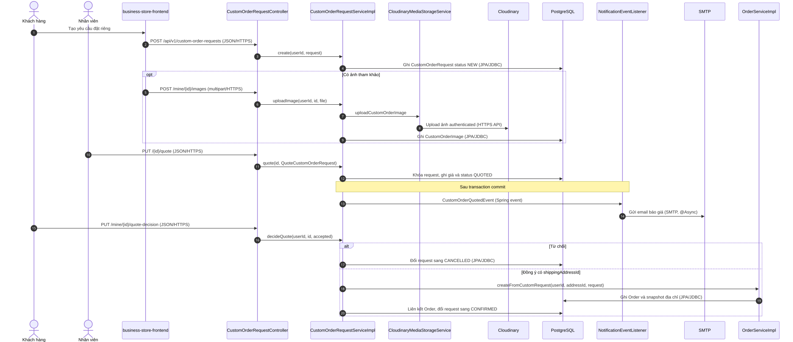

# Luồng báo giá đơn đặt riêng

Endpoint chính: `POST /api/v1/custom-order-requests`, `POST /api/v1/custom-order-requests/mine/{id}/images`, `PUT /api/v1/custom-order-requests/{id}/quote`, `PUT /api/v1/custom-order-requests/mine/{id}/quote-decision`.

Nguồn Mermaid: [sequence](../diagrams/flow-custom-order-quote-sequence.mmd) · [activity](../diagrams/flow-custom-order-quote-activity.mmd).

Khách chỉ được upload ảnh tham khảo khi request đang `NEW`. Nhân viên quote chuyển request `NEW → QUOTED`; `CustomOrderQuotedEvent` được xử lý sau commit để tạo notification và gửi email. Khi khách đồng ý, yêu cầu phải có `shippingAddressId`; `OrderServiceImpl.createFromCustomRequest` tạo Order, sau đó request liên kết đơn và trở thành `CONFIRMED`.

Evidence: `CustomOrderRequestController.java`; `CustomOrderRequestServiceImpl.java`; `OrderServiceImpl.java`; `NotificationEventListener.java`; `CloudinaryMediaStorageService.java`.
