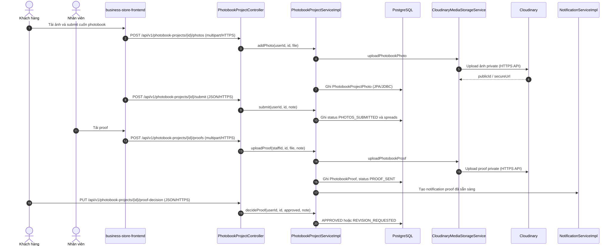

# Luồng ảnh và duyệt proof photobook

Endpoint chính: `POST /api/v1/photobook-projects/{id}/photos`, `POST /api/v1/photobook-projects/{id}/submit`, endpoint upload proof và `PUT /api/v1/photobook-projects/{id}/proof-decision`.

Nguồn Mermaid: [sequence](../diagrams/flow-photobook-proof-sequence.mmd) · [activity](../diagrams/flow-photobook-proof-activity.mmd).

Khách chỉ thêm/xóa ảnh khi project ở `AWAITING_PHOTOS`; submit yêu cầu đủ số ảnh tối thiểu và sinh spread. Nhân viên upload proof làm project thành `PROOF_SENT` và tạo notification. Khách hoặc duyệt (`APPROVED`) hoặc yêu cầu sửa (`REVISION_REQUESTED`), yêu cầu ghi chú và còn quota revision.

Evidence: `PhotobookProjectController.java`; `PhotobookProjectServiceImpl.java`; `PhotobookLayoutEngine.java`; `CloudinaryMediaStorageService.java`; `NotificationServiceImpl.java`.

Chưa xác minh: bước sản xuất/in/vận chuyển sau `APPROVED` không có workflow nối trực tiếp từ photobook project trong các file đã rà soát.
